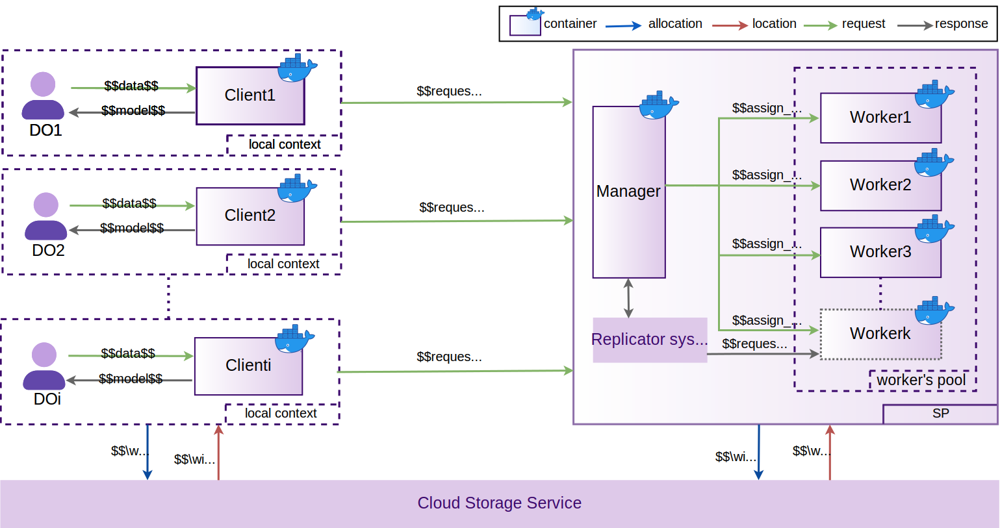

<!-- # Platform Architecture -->

## 1. General Interaction Model

The Rory platform utilizes an elastic model for Privacy-Preserving Data Mining as a Service (PPDMaaS). This architecture maps traditional PPDM entities —the Data Owner (DO) and the Service Provider (SP)— to specific cloud-native components: the **Client**, the **Manager**, and the **Worker**.

### Core Components and Workflow
* **Client (Data Owner side):** Extracts local data partitions, encrypts them, and segments them for secure transmission. It sends processing requests to the Manager and, upon completion, retrieves and decrypts the final model from the Cloud Storage System (CSS).
* **Manager (Service Provider side):** Acts as the orchestrator. It receives requests from the Client, coordinates the PPDM tasks, and manages the CSS pipelines.
* **Worker:** Retrieves the segmented, encrypted data from the CSS, executes the requested PPDM algorithm, and outputs an encrypted model back to the CSS.

## 2. Core Components

### 2.1 Client

<!--  -->

  

<!-- 

  

 -->

The **Client** component operates on the Data Owner side. It acts as the primary interface for users, responsible for preparing, encrypting, and managing data prior to its externalization to the cloud. Its architecture is divided into the following key layers:

* **Access Layer:** Handles user authentication, verifies credentials, and establishes secure communication sessions with the platform.
* **Processing Layer (Processing Stack):** The functional core that manages the data transformation lifecycle. For outbound data, the *Request Manager* routes data through *Segmentation* and *Encryption* to create secure, manageable chunks. For inbound results, it performs *Integration* (reassembling the chunks) and *Decryption* using the DO's key to recover the final model.
* **Processing Layer (Storage Stack):** Handles direct communication with the Cloud Storage System (CSS). Its *I/O Management* sub-layer executes *Write* operations for outbound data chunks and *Read* operations to fetch the incoming encrypted models.
* **Data Layer:** Acts as a secure, local object-based repository. It manages temporary storage, handles metadata, and synchronizes the transport pipeline between the Client and the platform's workers.
* **Audit:** Continuously logs system events and operations across all layers to ensure complete traceability, facilitate security audits, and monitor performance.

### 2.2 Manager

  

The **Manager** component operates on the Service Provider side and plays a fundamental role in the PPDMaaS platform. It acts as the core orchestrator, responsible for managing and coordinating all PPDM-related operations. Its primary functions include task coordination (assigning client requests to workers), load balancing (distributing resources efficiently for elasticity), and CSS interaction (coordinating secure data exchange).

Its architecture is organized into the following key layers:

* **Access Layer:** Manages user authentication and credential validation. It ensures that only authorized users associated with SP entities can access the platform's services, establishing a secure connection for load balancing and CSS interactions.
* **Processing Layer (Processing Stack):** Orchestrates data mining tasks sent by clients. The *Operations Management* sub-layer sets routing policies for processing tasks. The *PPDM Mesh* associates client requests with specific PPDM services. The *Systemic Replication Client* communicates with the replication system to dynamically deploy new workers during high demand. Finally, the *Load Balancing* sub-layer evenly distributes tasks among the resources available in the *Worker's Pool*.
* **Processing Layer (Storage Stack):** Dynamically builds and manages virtual storage spaces (buckets). The *Ball Manager* handles the buckets used by workers to receive input data and deliver encrypted models. The *Placement* sub-layer handles the virtual integration between buckets and workers. *Replication Management* (including *Systemic* and *Ball* sub-layers) defines the number of buckets needed to avoid storage bottlenecks. A dedicated *Load Balancing* sub-layer further optimizes bucket usage.
* **Data Layer:** Stores and manages metadata associated with assigned tasks, facilitating seamless coordination between clients and workers. It provides tools for temporary storage, secure transport pipelines for encrypted data, and automated recovery of generated models.
* **Audit:** Continuously logs relevant events across the entire component to guarantee traceability, enable performance analysis, and improve the overall efficiency of the platform.

### 2.3 Worker

  

The **Worker** component is the execution engine of the PPDMaaS platform. It applies a catalog of Privacy-Preserving Data Mining methods directly to encrypted data, ensuring privacy throughout the analysis process without ever needing to decrypt the data. Workers are scalable and dynamically adapt to workload variations.

Its architecture is organized into the following key layers:

* **Access Layer:** Authenticates and authorizes incoming processing requests, ensuring that task assignments come from a legitimate and authorized Manager.
* **Processing Layer (Processing Stack):** The core execution environment. The *Integration* sub-layer retrieves encrypted data chunks from assigned buckets and reconstructs the dataset. The *Mining Process* applies the specifically requested PPDM algorithm (e.g., Sk-Means, SKNN) to generate a model. Finally, the *Segmentation* sub-layer divides this resulting encrypted model into chunks for efficient storage and transmission. A *Query* sub-layer allows access to previously generated models.
* **Processing Layer (Storage Stack):** Handles communication with the Cloud Storage System (CSS). The *I/O Management* sub-layer coordinates *Read* operations to fetch the incoming data chunks and *Write* operations to safely store the newly generated encrypted model chunks back to the CSS.
* **Data Layer:** Organizes and manages storage connectors to efficiently handle the encrypted models. It establishes an object-based shared storage pattern, ensuring that relevant data and metadata remain securely accessible to all authorized entities within the platform.

### 2.4 External Systems

In the Rory platform, external systems are responsible for managing the dynamic scaling and secure storage of encrypted data and models. These systems ensure the platform remains elastic and secure under varying workloads.

* **Replicator System:** Manages the dynamic creation and retraction of *Workers* based on real-time processing demand. Operating on a systemic replication model, it monitors the workload and automatically spins up new workers during spikes to handle additional tasks. Conversely, it safely terminates idle workers when demand drops. This approach makes efficient use of resources and ensures consistent service performance.
* **Cloud Storage System (CSS):** Provides a secure and scalable environment for storing encrypted data and models. It organizes information into virtual storage spaces (buckets), securely managing both the inbound data and the resulting encrypted models generated during PPDM execution. The CSS features tools for temporary storage, secure transport pipelines, and automated recovery. It strictly limits access to authorized entities and synchronizes the data flow between Clients and Workers, maintaining data integrity throughout the entire process. See more [here](https://jub-ecosystem.github.io/mictlanx-client/#/).